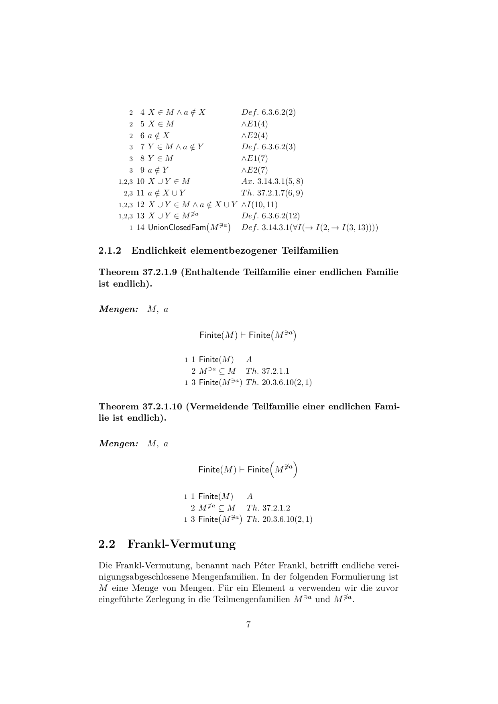

# Die Grundlagen der Mathematik

**A German-language, 43-volume LaTeX manuscript that develops mathematics from
logic and set theory using explicit natural-deduction proof tables in the style
of E. J. Lemmon.**

**Ein deutschsprachiges LaTeX-Manuskript in 43 Bänden, das Mathematik aus Logik
und Mengenlehre mithilfe expliziter Beweistabellen im Stil von E. J. Lemmon
aufbaut.**

[English](#english) · [Deutsch](#deutsch) ·
[PDF catalogue / PDF-Verzeichnis](VOLUMES.md) · [Building](BUILDING.md) ·
[Contributing](CONTRIBUTING.md) · [License / Lizenz](LICENSE.md)

---

## English

### What this project is

*Die Grundlagen der Mathematik* (*Foundations of Mathematics*) is a work in
progress that makes proof dependencies unusually explicit. Its current scope
runs from propositional and predicate logic through ZFC set theory, functions,
number systems, order theory and graph theory to semigroups, lattices, Frankl's
conjecture, and metric spaces.

The combined manuscript currently contains more than 1,700 pages. The project
is written primarily in German; formulas and proof tables are largely
language-independent.

### What makes it different

- Proofs are displayed as Lemmon-style tables recording open assumptions,
  inference rules, and referenced lines.
- Definitions, axioms, and theorems are arranged in an explicit dependency
  order rather than only by conventional subject boundaries.
- Each volume can be built separately while retaining verified cross-volume
  references.
- The LaTeX/Lua tooling audits labels, destinations, registries, and build
  dependencies.

This is a human-written mathematical manuscript, not a Lean, Coq, or Isabelle
formalization. The automated checks verify document and reference integrity;
they do **not** certify mathematical correctness.

### Where to start

- [Volume 01: Foundations of Logic](<output/pdf/Bd. 01 - Grundlagen der Logik.pdf>)
  introduces the formal language and explains how to read the proof tables.
- [Volume 03: Set Theory](<output/pdf/Bd. 03 - Mengenlehre.pdf>) shows the
  foundational method on a substantial body of mathematics.
- [Volume 26: Trees](<output/pdf/Bd. 26 - Bäume.pdf>) develops the axiomatic
  tree language used by the subsequent construction of bracketing trees.
- [Volume 42: Frankl's Conjecture](<output/pdf/Bd. 42 - Frankls Vermutung.pdf>)
  is a research-oriented application collecting set-theoretic, quotient, and
  semilattice formulations and proved special cases.
- [Volume 43: Metric Spaces and Completeness](<output/pdf/Bd. 43 - Metrische Räume und Vollständigkeit.pdf>)
  is a comparatively compact entry into the analytic branch.
- The [complete bilingual volume catalogue](VOLUMES.md) links all current PDFs.

[](<output/pdf/Bd. 42 - Frankls Vermutung.pdf>)

*Example: explicit proof tables in Volume 42. Click the image to open the
volume.*

### Intended audience

The manuscript is most likely to be useful to readers interested in
mathematical logic, foundations, explicit proof dependencies, proof pedagogy,
or one of the later specialist topics. Despite starting from first principles,
it is not currently designed as a conventional beginner textbook: it is dense,
contains few exercises, and prioritizes explicit derivation over intuition and
examples.

### Status and limitations

- Active work in progress; organization, notation, and proofs may change.
- Not peer reviewed and not machine checked by a proof assistant.
- Some construction principles are temporarily isolated as explicit axiomatic
  interfaces while their derivation is still being developed.
- Current published PDF snapshots are in German.

Corrections and focused mathematical criticism are welcome. Please see
[CONTRIBUTING.md](CONTRIBUTING.md) before opening a substantial pull request.

### Building and citation

The complete manuscript is built with LuaLaTeX:

```powershell
latexmk -lualatex -interaction=nonstopmode -halt-on-error -file-line-error main.tex
```

Standalone builds, cross-volume dependencies, the verified registry cache, and
Overleaf notes are documented in [BUILDING.md](BUILDING.md). Citation metadata
is available in [CITATION.cff](CITATION.cff).

The original manuscript and editorial content are licensed under
[CC BY 4.0](LICENSE.md#manuscript-and-project-content-cc-by-40); the software
and build infrastructure are licensed under the
[MIT License](LICENSE.md#software-and-build-infrastructure-mit). See
[LICENSE.md](LICENSE.md) for the exact file scope and attribution guidance.

---

## Deutsch

### Worum es in diesem Projekt geht

*Die Grundlagen der Mathematik* ist ein im Aufbau befindliches Manuskript, das
Beweisabhängigkeiten ungewöhnlich explizit sichtbar macht. Der derzeitige
Umfang reicht von Aussagen- und Prädikatenlogik über ZFC-Mengenlehre,
Funktionen, Zahlbereiche, Ordnungs- und Graphentheorie bis zu Halbgruppen,
Verbänden, Frankls Vermutung und metrischen Räumen.

Der Gesamtband umfasst gegenwärtig mehr als 1.700 Seiten. Der Text ist
überwiegend deutsch; Formeln und Beweistabellen sind weitgehend
sprachunabhängig.

### Was das Projekt besonders macht

- Beweise erscheinen als Tabellen im Lemmon-Stil mit offenen Annahmen,
  Schlussregeln und Zeilenverweisen.
- Definitionen, Axiome und Sätze folgen einer expliziten Abhängigkeitsordnung
  und nicht nur der üblichen Fächereinteilung.
- Jeder Band kann einzeln gebaut werden und behält dabei geprüfte Verweise auf
  frühere Bände.
- Die LaTeX-/Lua-Infrastruktur prüft Marken, Sprungziele, Registries und
  Build-Abhängigkeiten.

Das Projekt ist ein von Menschen geschriebenes mathematisches Manuskript und
keine Formalisierung in Lean, Coq oder Isabelle. Die automatischen Prüfungen
sichern Dokument- und Referenzintegrität, **nicht** die mathematische
Korrektheit.

### Empfohlene Einstiege

- [Band 01: Grundlagen der Logik](<output/pdf/Bd. 01 - Grundlagen der Logik.pdf>)
  führt die formale Sprache ein und erklärt die Beweistabellen.
- [Band 03: Mengenlehre](<output/pdf/Bd. 03 - Mengenlehre.pdf>) zeigt die
  Methode an einem umfangreichen mathematischen Gebiet.
- [Band 26: Bäume](<output/pdf/Bd. 26 - Bäume.pdf>) entwickelt die
  axiomatische Baumsprache für die anschließende Konstruktion der
  Klammerungsbäume.
- [Band 42: Frankls Vermutung](<output/pdf/Bd. 42 - Frankls Vermutung.pdf>) ist
  eine forschungsnahe Anwendung mit Mengen-, Quotienten- und
  Halbverbandsfassungen sowie bewiesenen Spezialfällen.
- [Band 43: Metrische Räume und Vollständigkeit](<output/pdf/Bd. 43 - Metrische Räume und Vollständigkeit.pdf>)
  bietet einen vergleichsweise kompakten Einstieg in den analytischen Zweig.
- Das [vollständige zweisprachige Bandverzeichnis](VOLUMES.md) verlinkt alle
  aktuellen PDFs.

### Zielgruppe

Das Manuskript richtet sich vor allem an Menschen mit Interesse an
mathematischer Logik, Grundlagenfragen, expliziten Beweisabhängigkeiten,
Beweisdidaktik oder einzelnen späteren Fachgebieten. Trotz des Aufbaus von den
Grundlagen her ist es derzeit kein gewöhnliches Anfängerlehrbuch: Die
Darstellung ist dicht, enthält nur wenige Übungen und priorisiert explizite
Herleitungen gegenüber Anschauung und Beispielen.

### Stand und Grenzen

- Aktives Work in Progress; Gliederung, Notation und Beweise können sich ändern.
- Nicht begutachtet und nicht durch einen Beweisassistenten maschinell geprüft.
- Einige Konstruktionsprinzipien sind vorläufig als ausdrücklich bezeichnete
  axiomatische Schnittstellen isoliert, solange ihre Herleitung noch entwickelt
  wird.
- Die veröffentlichten PDF-Schnappschüsse sind derzeit deutschsprachig.

Korrekturen und konkrete mathematische Kritik sind willkommen. Vor einem
umfangreichen Pull Request bitte [CONTRIBUTING.md](CONTRIBUTING.md) lesen.

### Bauen und Zitieren

Der Gesamtband wird mit LuaLaTeX gebaut:

```powershell
latexmk -lualatex -interaction=nonstopmode -halt-on-error -file-line-error main.tex
```

Standalone-Builds, Bandabhängigkeiten, der verifizierte Registry-Cache und
Overleaf-Hinweise stehen in [BUILDING.md](BUILDING.md). Zitiermetadaten enthält
[CITATION.cff](CITATION.cff).

Die ursprünglichen Manuskript- und Redaktionsinhalte stehen unter
[CC BY 4.0](LICENSE.md#manuscript-and-project-content-cc-by-40); Software und
Build-Infrastruktur stehen unter der
[MIT-Lizenz](LICENSE.md#software-and-build-infrastructure-mit). Die genaue
Dateizuordnung und Hinweise zur Namensnennung enthält
[LICENSE.md](LICENSE.md).
