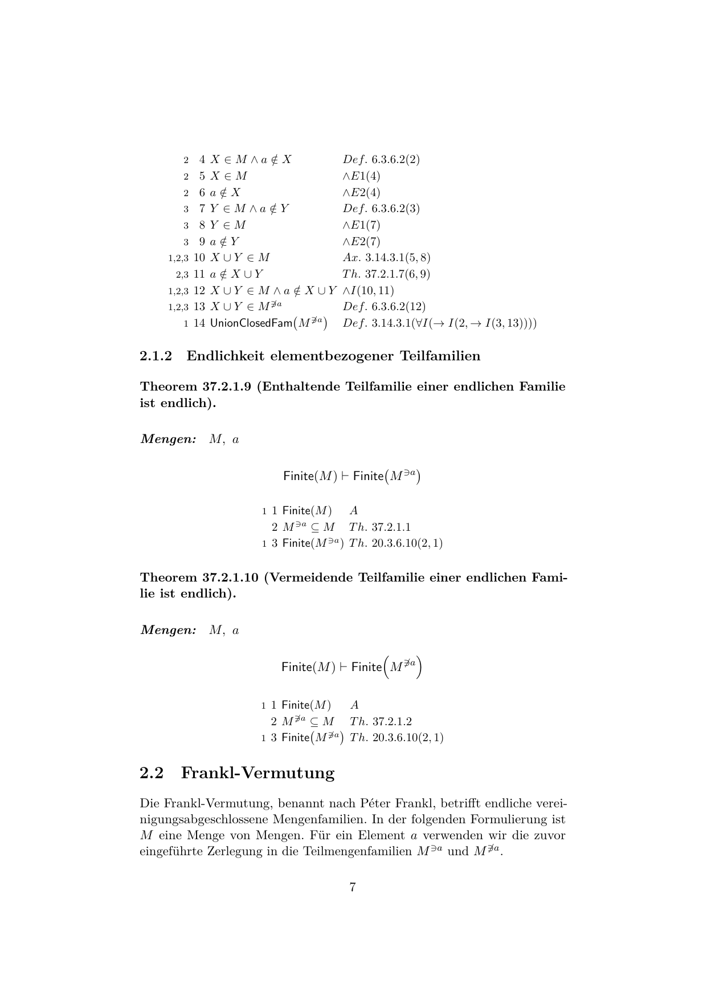

# Die Grundlagen der Mathematik

**A German-language LaTeX manuscript with 48 subject volumes and an opening
overview that develops mathematics from
logic and set theory using explicit natural-deduction proof tables in the style
of E. J. Lemmon.**

**Ein deutschsprachiges LaTeX-Manuskript in 48 Fachbänden mit vorangestelltem
Überblick, das Mathematik aus Logik
und Mengenlehre mithilfe expliziter Beweistabellen im Stil von E. J. Lemmon
aufbaut.**

[English](#english) · [Deutsch](#deutsch) ·
[PDF catalogue / PDF-Verzeichnis](VOLUMES.md) · [Building](BUILDING.md) ·
[Contributing](CONTRIBUTING.md) · [License / Lizenz](LICENSE.md)

Die PDFs unter `output/` sind in elf nummerierte Themenordner gegliedert.
Die Hauptbände stehen direkt im jeweiligen Themenordner; ergänzende
Ausarbeitungen liegen darunter in `Ergänzungen/<Thema>/`.
Die Bandnummern bleiben erhalten; die Ordnerzuordnung und Hinweise für
reMarkable stehen im [Bandverzeichnis](VOLUMES.md).

[Band 00: Überblick über die Bände](<output/00 Einstieg und Gesamtband/Bd. 00 - Überblick über die Bände.pdf>)
stellt Definitionen und Strukturaxiome den zentralen Resultaten gegenüber.
Gruppen und Ringe sind ab Band 40 nach Strukturklassen auf eigene Bände verteilt. Die bisherige Übersicht
„Band 27 auf einen Blick“ steht jetzt im Überblicksband.

Als Pilot einer zusätzlichen Lesefassung ist der Satz von Cantor–Bernstein
aus Band 08 in zwei verknüpften Auszügen verfügbar:
[Lesefassung](<output/03 Relationen und Funktionen/Ergänzungen/Cantor-Bernstein/Bd. 08 - Cantor-Bernstein - Lesefassung.pdf>) und
[Beweistabellen](<output/03 Relationen und Funktionen/Ergänzungen/Cantor-Bernstein/Bd. 08 - Cantor-Bernstein - Beweistabellen.pdf>).
Die reguläre Band- und Gesamtausgabe enthält den Hauptsatz und verlinkt
unmittelbar dessen Beweis in den Beweistabellen. Dort stehen eine Definition,
sieben Hilfssätze, drei H-Hilfsresultate und alle acht Tabellenbeweise.
Die Hilfsaussagen haben den eigenen Nummernraum `8E`; der Hauptsatz wird
im Beweisband nur referenziert.
Der Pilot umfasst diesen Abschnitt und den Anschluss an die
Gleichmächtigkeit in Band 11; er ist keine Lesefassung aller Fachbände.
Die Lesefassung enthält einen zusammenhängenden Beweis, eine knappe
Konstruktionsübersicht und einen Vergleich mit historischen Originalbeweisen.
Die Lesefassung verknüpft den Hauptsatz im Fachband mit den Hilfsaussagen
und Ableitungstabellen im Beweisband.

Nach demselben Prinzip ist das Mogiljanskaja-Gegenbeispiel aus Band 28
ausgelagert:
[Lesefassung](<output/07 Halbgruppen und Monoide/Ergänzungen/Mogiljanskaja-Gegenbeispiel/Bd. 28 - Mogiljanskaja-Gegenbeispiel - Lesefassung.pdf>) und
[Beweistabellen](<output/07 Halbgruppen und Monoide/Ergänzungen/Mogiljanskaja-Gegenbeispiel/Bd. 28 - Mogiljanskaja-Gegenbeispiel - Beweistabellen.pdf>).
Die Lesefassung erklärt vollständig, warum nicht isomorphe Halbgruppen
isomorphe Potenzhalbgruppen besitzen können. Die Beweistabellen enthalten
die formalen Ableitungen einschließlich der Einzelargumente M1–M17 und
der bisher in Band 21 behandelten Schichten, Reservemengen und
Parametrisierungen des Gegenbeispiels. Die allgemeinen Folgensätze bleiben
in Band 21; ein Anwendungshinweis führt zu den Begleitfassungen.
Band 28 und der Gesamtband enthalten dazu nur den eigenständigen
Existenzsatz, seine Bedeutung und die Verweise auf beide Begleitfassungen.
Die konkrete Konstruktion und ihre Hilfsaussagen stehen ausschließlich in
den Begleitwerken. Für formale Verweise sind die Beweistabellen mit dem
eigenen Nummernpräfix `28E` maßgeblich.

Auch der Dedekindsche Rekursionssatz aus Band 10 besitzt zwei Begleitfassungen:
[Lesefassung](<output/04 Zahlen und Folgen/Ergänzungen/Dedekindscher Rekursionssatz/Bd. 10 - Dedekindscher Rekursionssatz - Lesefassung.pdf>) und
[Beweistabellen](<output/04 Zahlen und Folgen/Ergänzungen/Dedekindscher Rekursionssatz/Bd. 10 - Dedekindscher Rekursionssatz - Beweistabellen.pdf>).
Band 10 und der Gesamtband enthalten die Hauptaussage, ihre Bedeutung und
die Rekursionsabbildung mit den für Anwendungen nötigen Eigenschaften.
Die Konstruktion über den kleinsten rekursionsadmissiblen Graphen und ihre
Hilfsaussagen stehen in den Begleitfassungen. Die Beweistabellen sind mit
dem eigenen Nummernpräfix `10E` die Referenzquelle für diese Konstruktion.

Ein [Ausbauvorschlag bis zu Gödels Unvollständigkeitssätzen](docs/goedel-ausbau.md)
beschreibt mögliche zusätzliche Fachbände und ihre Voraussetzungen.

Die Klammerungsunabhängigkeit endlicher Halbgruppenprodukte ist ebenfalls
in einer [Lesefassung](<output/07 Halbgruppen und Monoide/Ergänzungen/Klammerungsunabhängigkeit/Bd. 28 - Klammerungsunabhängigkeit - Lesefassung.pdf>)
und einem [Beweisband](<output/07 Halbgruppen und Monoide/Ergänzungen/Klammerungsunabhängigkeit/Bd. 28 - Klammerungsunabhängigkeit - Beweistabellen.pdf>) ausgearbeitet.
„Warum wir Klammern weglassen dürfen“ führt von den Wörtern und Bäumen
aus Band 27 über das Blockgesetz zur Unabhängigkeit des Produktwerts
von der Klammerung. Band 28 und der Gesamtband enthalten den Hauptsatz
28.2.3.4 und eine Anmerkung zur Produktschreibweise mit Verweisen auf beide
Ergänzungen. Die sechs Hilfsresultate stehen mit ihren bisherigen Nummern
ausschließlich im Beweisband. Dort stehen alle sieben Tabellenbeweise;
der Schlussbeweis verweist auf den Hauptsatz in Band 28.

Die Konstruktion der ganzen Zahlen aus Band 17 ist in einer
[Lesefassung](<output/04 Zahlen und Folgen/Ergänzungen/Ganze Zahlen/Bd. 17 - Ganze Zahlen - Lesefassung.pdf>)
und einem [Beweisband](<output/04 Zahlen und Folgen/Ergänzungen/Ganze Zahlen/Bd. 17 - Ganze Zahlen - Beweistabellen.pdf>) ausgearbeitet.
Die Lesefassung führt von Differenzenpaaren über Negation, Addition und
Multiplikation zu Ordnung, Normalformen, Diskretheit und zweiseitiger Induktion.
Sie endet mit dem Nachweis der vollständigen Ganzzahlaxiomatik und erklärt
den Übergang vom konkreten Modell zur axiomatischen Verwendung.
Die Modellkonstruktion und alle 94 Tabellenbeweise stehen im Ergänzungsband;
seine lokalen Aussagen tragen den Präfix `17E`. Band 17 und der Gesamtband
behalten die vollständige Axiomatik, den Modellsatz und die öffentlich
benötigten Aussagen mit ihren bisherigen Nummern und Verweiszielen.

Die formalen Differenzen und der Einbettungssatz aus Band 41 besitzen eine
[Lesefassung](<output/08 Gruppen/Ergänzungen/Formale Differenzen/Bd. 41 - Formale Differenzen - Lesefassung.pdf>)
und einen [Beweisband](<output/08 Gruppen/Ergänzungen/Formale Differenzen/Bd. 41 - Formale Differenzen - Beweistabellen.pdf>).
„Wie aus Monoiden Gruppen werden“ knüpft an die Zahlkonstruktion aus Band 17
an und verallgemeinert ihr additives Bauprinzip: Jedes kommutative kürzbare
Monoid lässt sich in eine abelsche Gruppe einbetten. Die Lesefassung erklärt
die Rolle der Kürzbarkeit, die Repräsentantenunabhängigkeit und die
kanonische Einbettung; Multiplikation und Ordnung der ganzen Zahlen werden
in den Begleitfassungen zu Band 17 behandelt.
Band 41 und der Gesamtband behalten den Hauptsatz 41.4.5.4 und eine kurze
Erklärung der Konstruktion. Die Definitionen, Hilfsaussagen und alle
zugehörigen Tabellenbeweise stehen im Ergänzungsband mit dem Präfix `41E`.
Beide Themen haben damit eigene Lesefassungen und eigene Beweisbände.
Auch das Produktbeispiel mit zwei Ganzzahlkoordinaten, das Maximum-Gegenbeispiel
und die notwendigen Einbettungsbedingungen besitzen dort eigene Tabellenbeweise.
Die Hilfssätze werden jeweils vor ihrer ersten Verwendung hergeleitet.

---

Die Entsprechung zwischen Halbverbandsoperationen und Ordnungen mit Paarsuprema
aus Band 45 besitzt ebenfalls eine
[Lesefassung](<output/05 Ordnungen und Verbände/Ergänzungen/Halbverbände und Ordnung/Bd. 45 - Halbverbände und Ordnung - Lesefassung.pdf>) und
[Beweistabellen](<output/05 Ordnungen und Verbände/Ergänzungen/Halbverbände und Ordnung/Bd. 45 - Halbverbände und Ordnung - Beweistabellen.pdf>).
„Wie aus einer Rechenregel eine Ordnung wird“ führt am Vereinigungsbeispiel
von den Rechengesetzen zur Ordnung und über Paarsuprema wieder zurück.
Die 19 Kerntabellen und vier Beispieltabellen stehen im Ergänzungsband.
Alle bestehenden Aussagen, Nummern und Referenzziele bleiben in Band 45
und im Gesamtband erhalten; die Ergänzungen verweisen auf diese Aussagen.

---

Die Spezialfälle von Frankls Vermutung bei kleinen Mengengliedern aus Band 46
besitzen eine
[Lesefassung](<output/02 Mengenlehre und Mengenfamilien/Ergänzungen/Frankls Spezialfälle/Bd. 46 - Frankls Spezialfälle - Lesefassung.pdf>) und
[Beweistabellen](<output/02 Mengenlehre und Mengenfamilien/Ergänzungen/Frankls Spezialfälle/Bd. 46 - Frankls Spezialfälle - Beweistabellen.pdf>).
„Warum ein Element in mindestens der Hälfte vorkommt“ führt von einem
Mengenbeispiel über injektive Zuordnungen zum Einermengenfall und zur
Vierfelderzerlegung für den Zweiermengenfall. Auch der Fall eines gemeinsamen
Elements wird erklärt. Ein historischer Abriss und eine Schlussbemerkung
schließen die Lesefassung ab. Die 17 zugehörigen Tabellen stehen im Beweisband;
alle bisherigen Aussagen, Nummern und Referenzziele bleiben in Band 46 und im Gesamtband.
Ein Beispiel mit 19 Mengen zeigt die Grenze beim Dreiermengenfall:
Die drei Elemente eines enthaltenen Mitglieds kommen jeweils nur neunmal vor.
Zum neuen Beispiel enthalten Fach- und Gesamtband nur den Existenzsatz;
die Hilfssätze und Beweise stehen im ergänzenden Beweisband.
Die allgemeine Frankl-Vermutung wird dabei nicht bewiesen.

Die Gruppenrekonstruktion aus Band 40 besitzt eine
[Lesefassung](<output/08 Gruppen/Ergänzungen/Gruppenrekonstruktion/Bd. 40 - Gruppenrekonstruktion - Lesefassung.pdf>) und
[Beweistabellen](<output/08 Gruppen/Ergänzungen/Gruppenrekonstruktion/Bd. 40 - Gruppenrekonstruktion - Beweistabellen.pdf>).
„Wie man eine Gruppe in ihren Mengenprodukten wiedererkennt“ führt von der
Multiplikationstafel einer Zweiergruppe über die Erkennung von Einermengen
als Einheiten bis zum stärkeren Rekonstruktionssatz: Ist eine Grundstruktur
eine Gruppe, so erzwingt ein Isomorphismus der großen Potenzhalbgruppen
auch auf der anderen Seite eine isomorphe Gruppe. Die Lesefassung endet
mit einem historischen Abriss und einer Schlussbemerkung.
Zwölf Tabellen sind ausgelagert; alle Aussagen, Nummern und Verweisziele
bleiben in Band 40 und im Gesamtband erhalten. Die allgemeinen Grundlagen
der Einheitengruppentheorie bleiben im Fachband.

Die Nullprodukt-Rekonstruktion aus Band 37 besitzt eine
[Lesefassung](<output/07 Halbgruppen und Monoide/Ergänzungen/Nullprodukt-Rekonstruktion/Bd. 37 - Nullprodukt-Rekonstruktion - Lesefassung.pdf>) und
[Beweistabellen](<output/07 Halbgruppen und Monoide/Ergänzungen/Nullprodukt-Rekonstruktion/Bd. 37 - Nullprodukt-Rekonstruktion - Beweistabellen.pdf>).
„Was Nullprodukte verraten“ beweist den Spezialfall einer endlichen Halbgruppe
mit Null und genau zwei Produktwerten. Die Lesefassung erklärt, wie
Nullproduktprofile, ihre Ordnung und endliche Fasergrößen eine passende
Bijektion liefern. Der öffentliche Hauptsatz steht in Band 37; die privaten
Hilfssätze stehen unter `37E` in den Beweistabellen. Die allgemeine endliche
Potenzhalbgruppenvermutung wird damit nicht entschieden.

Totale Beschränktheit und Kompaktheit aus Band 47 werden in einer
[Lesefassung](<output/10 Metrische Räume/Ergänzungen/Totale Beschränktheit und Kompaktheit/Bd. 47 - Totale Beschränktheit und Kompaktheit - Lesefassung.pdf>)
und einem [Beweisband](<output/10 Metrische Räume/Ergänzungen/Totale Beschränktheit und Kompaktheit/Bd. 47 - Totale Beschränktheit und Kompaktheit - Beweise.pdf>) ausgearbeitet.
Die Lesefassung führt von endlichen Epsilon-Netzen zur Gleichwertigkeit von
Kompaktheit, Folgenkompaktheit sowie Vollständigkeit und totaler Beschränktheit.
Die neuen Definitionen und Sätze stehen in Band 47; ihre vollständigen Beweise
sind ausgelagert. Drei private Hilfssätze erhalten im Beweisband das Präfix `47E`.

## English

### What this project is

*Die Grundlagen der Mathematik* (*Foundations of Mathematics*) is a work in
progress that makes proof dependencies unusually explicit. Its current scope
runs from propositional and predicate logic through ZFC set theory, functions,
number systems, order theory and graph theory to semigroups, lattices, Frankl's
conjecture, and metric spaces.

The combined manuscript currently contains more than 1,700 pages. The project
is written primarily in German; formulas and proof tables are largely
language-independent.

### What makes it different

- Proofs are displayed as Lemmon-style tables recording open assumptions,
  inference rules, and referenced lines.
- Definitions, axioms, and theorems are arranged in an explicit dependency
  order rather than only by conventional subject boundaries.
- Each volume can be built separately while retaining verified cross-volume
  references.
- The LaTeX/Lua tooling audits labels, destinations, registries, and build
  dependencies.

This is a human-written mathematical manuscript, not a Lean, Coq, or Isabelle
formalization. The automated checks verify document and reference integrity;
they do **not** certify mathematical correctness.

### Where to start

- [Volume 01: Foundations of Logic](<output/01 Logik/Bd. 01 - Grundlagen der Logik.pdf>)
  introduces the formal language and explains how to read the proof tables.
- [Volume 03: Set Theory](<output/02 Mengenlehre und Mengenfamilien/Bd. 03 - Mengenlehre.pdf>) shows the
  foundational method on a substantial body of mathematics.
- [Volume 26: Trees](<output/06 Graphen, Bäume und Wörter/Bd. 26 - Bäume.pdf>) develops the axiomatic
  tree language used by the subsequent construction of bracketing trees.
- [Volume 46: Frankl's Conjecture](<output/02 Mengenlehre und Mengenfamilien/Bd. 46 - Frankls Vermutung.pdf>)
  is a research-oriented application collecting set-theoretic, quotient, and
  semilattice formulations and proved special cases.
- [Volume 47: Metric Spaces and Completeness](<output/10 Metrische Räume/Bd. 47 - Metrische Räume und Vollständigkeit.pdf>)
  is a comparatively compact entry into the analytic branch.
- [Volume 48: Axiomatic Set Theory II](<output/02 Mengenlehre und Mengenfamilien/Bd. 48 - Axiomatische Mengenlehre II.pdf>)
  is a meta-methodological supplement for power set, cardinality, and continuum
  arguments.
- The [complete bilingual volume catalogue](VOLUMES.md) links all current PDFs.

[](<output/02 Mengenlehre und Mengenfamilien/Bd. 46 - Frankls Vermutung.pdf>)

*Example: explicit proof tables in Volume 46. Click the image to open the
volume.*

### Intended audience

The manuscript is most likely to be useful to readers interested in
mathematical logic, foundations, explicit proof dependencies, proof pedagogy,
or one of the later specialist topics. Despite starting from first principles,
it is not currently designed as a conventional beginner textbook: it is dense,
contains few exercises, and prioritizes explicit derivation over intuition and
examples.

### Status and limitations

- Active work in progress; organization, notation, and proofs may change.
- Not peer reviewed and not machine checked by a proof assistant.
- Some construction principles are temporarily isolated as explicit axiomatic
  interfaces while their derivation is still being developed.
- Current published PDF snapshots are in German.

Corrections and focused mathematical criticism are welcome. Please see
[CONTRIBUTING.md](CONTRIBUTING.md) before opening a substantial pull request.

### Building and citation

The complete manuscript is built with LuaLaTeX:

```powershell
latexmk -lualatex -interaction=nonstopmode -halt-on-error -file-line-error main.tex
```

Standalone builds, cross-volume dependencies, the verified registry cache, and
Overleaf notes are documented in [BUILDING.md](BUILDING.md). Citation metadata
is available in [CITATION.cff](CITATION.cff).

The original manuscript and editorial content are licensed under
[CC BY 4.0](LICENSE.md#manuscript-and-project-content-cc-by-40); the software
and build infrastructure are licensed under the
[MIT License](LICENSE.md#software-and-build-infrastructure-mit). See
[LICENSE.md](LICENSE.md) for the exact file scope and attribution guidance.

---

## Deutsch

### Worum es in diesem Projekt geht

*Die Grundlagen der Mathematik* ist ein im Aufbau befindliches Manuskript, das
Beweisabhängigkeiten ungewöhnlich explizit sichtbar macht. Der derzeitige
Umfang reicht von Aussagen- und Prädikatenlogik über ZFC-Mengenlehre,
Funktionen, Zahlbereiche, Ordnungs- und Graphentheorie bis zu Halbgruppen,
Verbänden, Frankls Vermutung und metrischen Räumen.

Der Gesamtband umfasst gegenwärtig mehr als 1.700 Seiten. Der Text ist
überwiegend deutsch; Formeln und Beweistabellen sind weitgehend
sprachunabhängig.

### Was das Projekt besonders macht

- Beweise erscheinen als Tabellen im Lemmon-Stil mit offenen Annahmen,
  Schlussregeln und Zeilenverweisen.
- Definitionen, Axiome und Sätze folgen einer expliziten Abhängigkeitsordnung
  und nicht nur der üblichen Fächereinteilung.
- Jeder Band kann einzeln gebaut werden und behält dabei geprüfte Verweise auf
  frühere Bände.
- Die LaTeX-/Lua-Infrastruktur prüft Marken, Sprungziele, Registries und
  Build-Abhängigkeiten.

Das Projekt ist ein von Menschen geschriebenes mathematisches Manuskript und
keine Formalisierung in Lean, Coq oder Isabelle. Die automatischen Prüfungen
sichern Dokument- und Referenzintegrität, **nicht** die mathematische
Korrektheit.

### Empfohlene Einstiege

- [Band 01: Grundlagen der Logik](<output/01 Logik/Bd. 01 - Grundlagen der Logik.pdf>)
  führt die formale Sprache ein und erklärt die Beweistabellen.
- [Band 03: Mengenlehre](<output/02 Mengenlehre und Mengenfamilien/Bd. 03 - Mengenlehre.pdf>) zeigt die
  Methode an einem umfangreichen mathematischen Gebiet.
- [Band 26: Bäume](<output/06 Graphen, Bäume und Wörter/Bd. 26 - Bäume.pdf>) entwickelt die
  axiomatische Baumsprache für die anschließende Konstruktion der
  Klammerungsbäume.
- [Band 46: Frankls Vermutung](<output/02 Mengenlehre und Mengenfamilien/Bd. 46 - Frankls Vermutung.pdf>) ist
  eine forschungsnahe Anwendung mit Mengen-, Quotienten- und
  Halbverbandsfassungen sowie bewiesenen Spezialfällen.
- [Band 47: Metrische Räume und Vollständigkeit](<output/10 Metrische Räume/Bd. 47 - Metrische Räume und Vollständigkeit.pdf>)
  bietet einen vergleichsweise kompakten Einstieg in den analytischen Zweig.
- [Band 48: Axiomatische Mengenlehre II](<output/02 Mengenlehre und Mengenfamilien/Bd. 48 - Axiomatische Mengenlehre II.pdf>)
  ergänzt die formale Methodik für Aussagen zu Potenzmengen, Kardinalität und
  Kontinuum.
- Das [vollständige zweisprachige Bandverzeichnis](VOLUMES.md) verlinkt alle
  aktuellen PDFs.

### Zielgruppe

Das Manuskript richtet sich vor allem an Menschen mit Interesse an
mathematischer Logik, Grundlagenfragen, expliziten Beweisabhängigkeiten,
Beweisdidaktik oder einzelnen späteren Fachgebieten. Trotz des Aufbaus von den
Grundlagen her ist es derzeit kein gewöhnliches Anfängerlehrbuch: Die
Darstellung ist dicht, enthält nur wenige Übungen und priorisiert explizite
Herleitungen gegenüber Anschauung und Beispielen.

### Stand und Grenzen

- Aktives Work in Progress; Gliederung, Notation und Beweise können sich ändern.
- Nicht begutachtet und nicht durch einen Beweisassistenten maschinell geprüft.
- Einige Konstruktionsprinzipien sind vorläufig als ausdrücklich bezeichnete
  axiomatische Schnittstellen isoliert, solange ihre Herleitung noch entwickelt
  wird.
- Die veröffentlichten PDF-Schnappschüsse sind derzeit deutschsprachig.

Korrekturen und konkrete mathematische Kritik sind willkommen. Vor einem
umfangreichen Pull Request bitte [CONTRIBUTING.md](CONTRIBUTING.md) lesen.

### Bauen und Zitieren

Der Gesamtband wird mit LuaLaTeX gebaut:

```powershell
latexmk -lualatex -interaction=nonstopmode -halt-on-error -file-line-error main.tex
```

Standalone-Builds, Bandabhängigkeiten, der verifizierte Registry-Cache und
Overleaf-Hinweise stehen in [BUILDING.md](BUILDING.md). Zitiermetadaten enthält
[CITATION.cff](CITATION.cff).

Die ursprünglichen Manuskript- und Redaktionsinhalte stehen unter
[CC BY 4.0](LICENSE.md#manuscript-and-project-content-cc-by-40); Software und
Build-Infrastruktur stehen unter der
[MIT-Lizenz](LICENSE.md#software-and-build-infrastructure-mit). Die genaue
Dateizuordnung und Hinweise zur Namensnennung enthält
[LICENSE.md](LICENSE.md).
